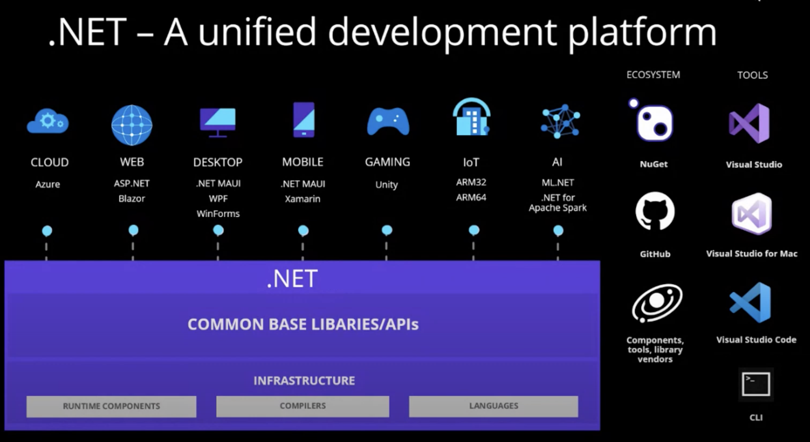
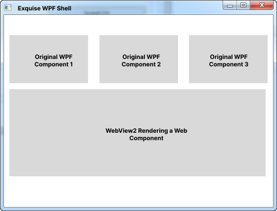
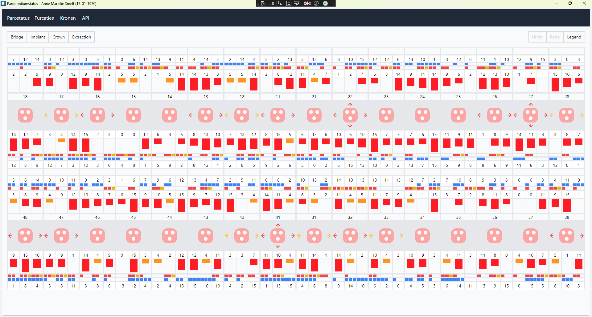
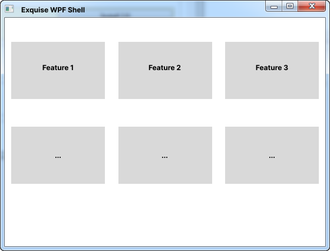
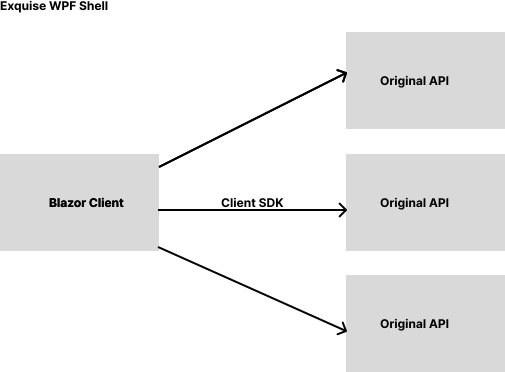
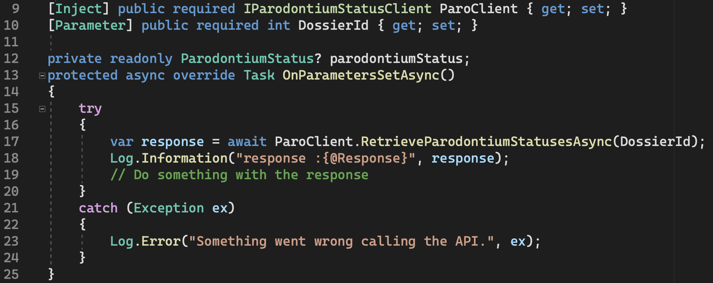

class: dark middle

# Blazor Workshop
> An introduction

---
### Before we start
# Installations
Download and install [.NET 8](https://dotnet.microsoft.com/en-us/download/dotnet/thank-you/sdk-8.0.303-windows-x64-installer)

---
# .NET Overview
<br/>
<br/>
<br/>
<br/>
<br/>


---
class: dark middle
name:mvc
# Hosting Models
> Traditional vs Blazor

---
### Hosting Models
# Model View Controller (MVC)

1. Client sends a HTTP Request for a specific page `/[controller/action]`
2. Server processes the request
    - `[controller]` is found in the `controller` folder.
    - Uses the method of the `[controller]` to handle the request.
    - `[controller]` looks for a `View` in the `Views/[controller]` folder.
    - `[View.cshtml]` which consists of C# + HTML is rendered (server).
    - HTTP Response with the content of the HTML page is returned.
3. Client can interact with the `page`
4. If there is an interaction (submitting a form, clicking a link), the client sends another HTTP Request to the server and the cycle repeats.
5. The server can send back a new page or partial page (AJAX).
    - Remember the jQuery days


---
name:hosting-models
### Hosting Models
# Blazor
Blazor is a web framework designed to run server-side in ASP.NET (Blazor Server) or client-side in the browser on a WebAssembly-based .NET runtime (Blazor WebAssembly). Regardless of the hosting model, **the app and component models are the same**. The biggest difference is **where** the app runs.
- Server side using SignalR (WebSockets)
- Client side (WASM)

Blazor
- [Single Page Application Framework](https://en.wikipedia.org/wiki/Single-page_application)
- Combination of the words Browser and Razor (.NET HTML View Engine)
- Capable of rendering views on the server and client.
- Utilises [WebAssembly (WASM)](https://blazor-university.com/overview/what-is-webassembly/) for client side rendering
 - Intermediate Binary like the Common Intermediate Language(CIL)
 - C# is compiled to WASM
 - Does not need plugins e.g. Silverlight, Flash, ...
 - Can run in all [modern browsers](https://caniuse.com/?search=wasm)
- Blazor Server uses SignalR to communicate between the client and server.
- Since .NET 8, the 2 hosting models are combined into a single project template.
    - However, blazor standalone (WASM) is still available and updated.
- Very similar to React, Angular, Vue, Svelte, ...
    - Uses a virtual DOM to update the actual DOM in the browser.

> More information about Render Trees and Virtual DOM can be found [here](https://blazor-university.com/components/render-trees/).

---
class: dark middle
name:blazor-server
# Hosting Models
> Blazor Server (Interactive)

---
### Blazor Server
# Schemantic

- Blazor Server **does not download any C&#35; code to the browser**.
    - Does however download css, js and html.
- Uses a **Web Socket connection** through SignalR.
- Cannot run without an active internet connection.
- Interactions are send to the server and a HTML diff is send back to the client.
- Very chatty, since **every** interaction is send to the server. 
    - Imagine a hover event on a button.

---
class: dark middle
name:blazor-wasm
# Hosting Models
> Blazor **W**eb **As**se**m**bly

---
### Blazor **W**eb **As**se**m**bly
# Schemantic

- Blazor Standalone is different than the other project templates.
- Only **takes care of the client side of things**. 
- In fact Blazor can be hosted on a **static file server**.
- Once the DLL's and .NET runtime are downloaded to the browser, Blazor runs in the **browser's sandbox**.
- Combined with a Web API, the client can fetch data from **a** server.
> Note that the API can be same server that hosts the Blazor WASM app if it's a ASP.NET Core server.

---
### Hosting Models
# Client Side (WASM)
- Pro's
    - Runs on the client, inside the browser, so it can be deployed as **static files**.
    - Blazor Wasm **can work off-line**.
    - Can run as a [Progressive Web App(PWA)](https://web.dev/progressive-web-apps/).
    - Server load is reduced, since it runs on the client's machine.
- Con's
    - Is initially slower since .NET DLL assemblies have to be downloaded (the first time), cached the second time.
    - The Mono Framework interprets .NET Intermediate Language so is slower than running server-side Blazor.
    - Only works on modern browsers
    - Single threaded
    - **Not SEO friendly** by default
        - Server-side pre-rendering can be "done", but in essence is still an issue combined with authentication.

---
### Hosting Models
# Server Side
- Pro's
    - Pre-renders HTML content before it is sent to the client
        - **SEO friendly** by default (server-side pre-rendering)
        - Faster start-up time
    - No requirement for Web Assembly
        - Works on **older browsers** (IE 11) 
        - .NET code can be debugged more easly in Visual Studio (code)
- Con's
    - Server sets up a in-memory session for **every client**
        - Memory and CPU are consumed by the server and not the client
        - Cannot work **without** an internet connection ([SignalR](https://docs.microsoft.com/en-us/aspnet/core/signalr/introduction?view=aspnetcore-5.0))
    - **Latency** can be an issue with events that fire frequently
        - Servers in Australia, clients in Europe

---
class: dark middle
# Integration
> Blazor in Exquise

---
### Integration
# Client side

- Blazor can be integrated in WPF applications.
- Using WebView2, a Chromium based browser control.
- WPF knows **nothing** about Blazor.
- Blazor knows **nothing** about WPF.
- Access and ID tokens are passed from WPF to Blazor WebView2 via LocalStorage.
- Every component can be swapped out to become a new web component.



---
### Client side
# Parostatus
<br/>
<br/>

> Example of Parostatus running inside WPF using Blazor.


---
### Integration
# Modularity
- Each "feature" is a separate Blazor project, hosted online as static files.
- Each team can be responsible for their own feature.
- Each feature can be updated independently.



---
### Integration
# Back-end

- WPF knows **nothing** about Blazor.
- Blazor knows **nothing** about WPF.
- No new API calls need to be developed.
- A C# Client SDK is being developed to call the original Exquise API's from C#.
    - Basically a HtppClient Wrapper to call the API's.




---
### Client SDK
# Example Code
<br/>
<br/>

> A Blazor Component calling the Client SDK to get a list of via the API.

---
class: dark middle
# Pracitical
> Blazor **W**eb **As**se**m**bly Standalone

---
### Hello Blazor
# Getting Started
We won't be using Blazor Server or Interactive mode in this workshop. We will be using Blazor Standalone (WASM). Since this is what we use in Exquise.

<sup class="right">Terminal</sup>

```
dotnet new blazorwasm -o MyStandAloneApp
cd MyStandAloneApp
```

Several files were created in the directory, to give you a simple Blazor app that is ready to run.
Some notable files are:
- `Program.cs`
    - Entry point of the application
- `wwwroot` directory
    - Contains static files like css, js, images, and the placeholder for the app to load.
- `App.razor`
    - The root component of the application
- `MainLayout.razor`
    - The layout of the application
- Pages directory
    - Some example pages

---
### Hello Blazor
# TODO's
What we're building:
<br/>
<br/>


---
### Workshop
# Pizza
1. Install dotnet 6.0.423 by downloading [this file](https://dotnet.microsoft.com/en-us/download/dotnet/thank-you/sdk-6.0.423-windows-x64-installer) and going through the wizard.
2. Go to the this link to start the [Blazor Workshop](https://github.com/dotnet-presentations/blazor-workshop)
